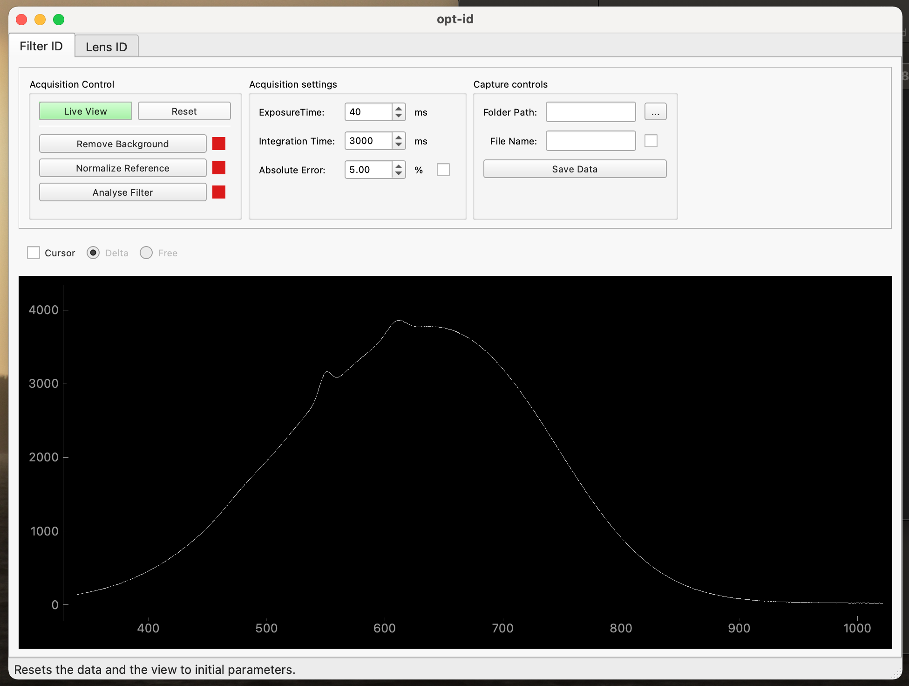

#Opt-ID - USB2000 Interface Software

This is a minimal UI for interfacing OceanOptics Spectrometers using the `seabreeze` package. It has been coded to replace the new but awful OceanView which was non-intuitive. If you go to the _Release_ tab, you will find the latest build. It has been built for MacOS BigSur and Windows 10.

## Installing

* Read the [HOWTO](./docs/HOWTOs/HOWTO-installOpticsId.md)

## **Main Functionalities**

- Live spectrum visualisation @≥100Hz
- Set exposure and integration time
- Remove a static background signal
- Normalize the light source.
- Interactive cursor to take on-graph measurements
- Save data easily in .csv format

